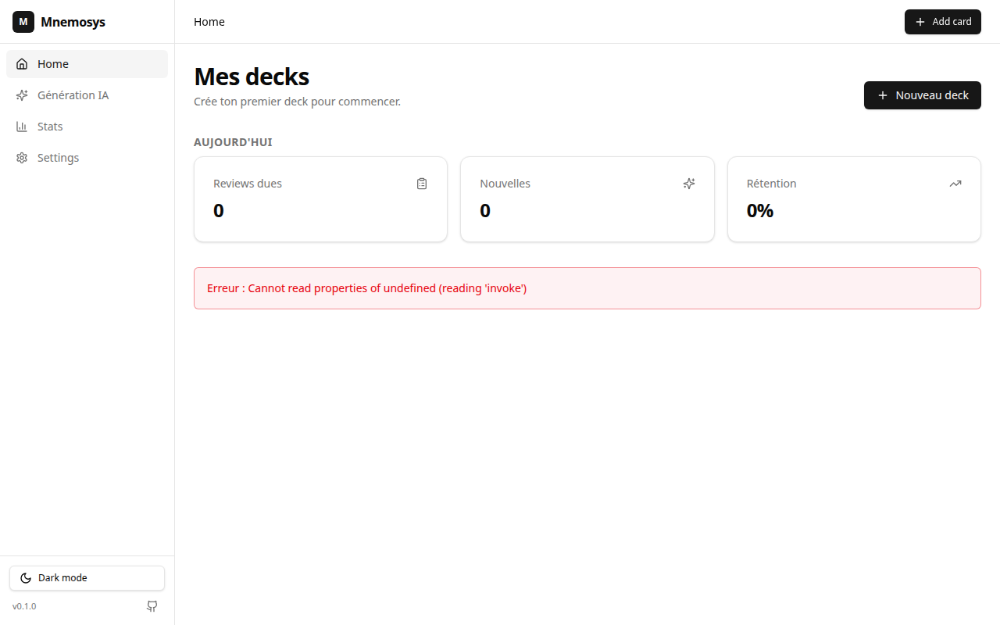

# Mnemosys

> L'app de mémorisation next-gen, propulsée par l'algorithme **FSRS-6** — 100 % locale, ultra-rapide, pensée clavier-first.

[](./CHANGELOG.md)
[](https://tauri.app)
[](https://react.dev)
[](https://www.rust-lang.org)
[](https://github.com/open-spaced-repetition/fsrs4anki/wiki/ABC-of-FSRS)



---

## Vision

Mnemosys est une app desktop de **répétition espacée (SRS)** qui pousse FSRS-6 et la stack moderne du web (React 19, Tauri 2, Rust) au service d'une seule chose : **te faire retenir plus, en révisant moins**. Pas de cloud obligatoire, pas de gamification creuse, juste un cycle review/feedback aussi serré que possible. C'est l'alternative légère, performante et auditable à Anki pour 2026.

## Statut

- **Session 1 — MVP Desktop** : ✅ livré
- **Session 2 — IA & contenu** : ✅ livré (AI gen + TTS + APKG + image-occlusion + reset_card)
- **Session 3 — Sync cloud** : ✅ scaffolding livré (désactivé tant qu'aucun projet Supabase n'est configuré)
- **Session 4 — FSRS Optimizer** : ✅ backend livré (UI optimizer + CI + signing à venir)
- **Vagues 1-9 — Recherche scientifique appliquée** : ✅ livrées (cf. [CHANGELOG.md](./CHANGELOG.md))
  - V1 Gamification éthique — streaks + achievements + deck mastery WaniKani-style
  - V2 Cognitive — type-the-answer + confidence rating (CBM) + pre-questioning IA
  - V3 Neuro modes — mood/sleep check-in + movement break + cyclic sighing
  - V4 Schedulers pluggables — FSRS-6 + SM-2 + Leitner 5-box par deck
  - V5 IA augmentée — Why?/Example auto + Interleaved Review mode
  - **V7 Tier S** — Sketch-before-flip + Delayed-JOL + Calibration Dashboard
  - **V8 Audio** — Deck Podcast NotebookLM-style + Whisper Mode Review
  - **V9 Moonshot** — Memory Palace 3D Builder (R3F + 3 templates 3D)
  - **S4-Final** — FSRS Optimizer UI + GitHub Actions CI + tauri-plugin-updater

## Différenciateurs vs Anki / RemNote / Mochi

- **La SEULE app SRS qui mesure la métacognition** (CBM confidence rating + scoring asymétrique)
- **Choix d'algorithme par deck** (FSRS-6 / SM-2 / Leitner)
- **Local-first + AI Augmented** (cohérent privacy-first Tauri)
- **Sourcing scientifique transparent** — chaque feature opt-in cite ses papers (effect sizes)

## Fonctionnalités (Session 1)

- **FSRS-6** via la crate `fsrs` 5.2 (21 paramètres, prévisualisation des intervalles, états `new` / `learning` / `review` / `relearning`). [Spec algo](https://github.com/open-spaced-repetition/fsrs4anki/wiki/ABC-of-FSRS).
- **Decks + cartes** avec trois templates : `basic`, `basic_reverse` (2 cartes générées par note) et `cloze` (`{{c1::texte}}` style Anki).
- **Session de review** : flip animé, 4 boutons de notation Again/Hard/Good/Easy avec **preview live des intervalles**, raccourcis clavier, suspension/édition à la volée, écran de fin avec confetti.
- **Dashboard de stats** : KPIs du jour, heatmap GitHub-style sur 1 an, courbes reviews/jour et rétention/jour avec sélecteur de période (7j / 30j / 90j / 1 an).
- **Import / export JSON** : round-trip portable (export ne contient pas l'historique de scheduling — design choice pour rester compatible entre bases).
- **4 decks démo (835 cartes)** : Vocabulaire EN→FR (500), Capitales du monde (195), Fondamentaux JavaScript/TypeScript (80), Biologie cellulaire (60).
- **Thèmes light / dark / system** persistés.
- **Recherche FTS5 trigram** sur le contenu et les tags des notes.
- **First-run wizard** trois slides + dialog d'aide raccourcis (`?`).

## Installation

### Prérequis communs

| Outil | Version |
|-------|---------|
| Node  | **22+** |
| pnpm  | **9+**  |
| Rust  | **1.81+** (via [rustup](https://rustup.rs)) |

### Dépendances système

#### Linux (Ubuntu / Debian 24.04+)
```bash
sudo apt update
sudo apt install -y \
  libwebkit2gtk-4.1-dev \
  libjavascriptcoregtk-4.1-dev \
  libsoup-3.0-dev \
  build-essential curl wget file libxdo-dev \
  libssl-dev libayatana-appindicator3-dev librsvg2-dev
```
Sur d'autres distros, équivalents de `webkit2gtk-4.1`, `javascriptcoregtk-4.1`, `libsoup-3.0`.

#### macOS (12+)
```bash
xcode-select --install
```
Rien d'autre — WebKit est embarqué dans le système.

#### Windows (10/11)
- **Microsoft Edge WebView2** : déjà présent sur Windows 11. Pour Windows 10, l'installer depuis le [Evergreen Bootstrapper](https://developer.microsoft.com/microsoft-edge/webview2/).
- Microsoft Visual Studio Build Tools 2022 (composant *Desktop development with C++*).

### Cloner et installer

```bash
git clone <repo-url> mnemosys
cd mnemosys
pnpm install
```

### Lancer en dev

```bash
pnpm tauri:dev
```
Le premier build Rust dure environ **5 minutes** (compilation de Tauri + dépendances). Les suivants sont instantanés grâce au cache.

### Build de release

```bash
pnpm tauri:build
```
Produit un binaire optimisé (`opt-level=s`, LTO, strip) + un installeur natif (`.deb`/`.AppImage` sur Linux, `.dmg`/`.app` sur macOS, `.msi`/`.exe` sur Windows). *Note : ce chemin n'a pas été validé en Session 1 (release packaging = Session 4).*

## Stack technique

| Couche | Techno | Version |
|--------|--------|---------|
| Bundler frontend | Vite | 7.x |
| Framework UI | React | 19.2 |
| Langage UI | TypeScript | 6.x |
| Styling | Tailwind CSS | 4.x (`@tailwindcss/vite`) |
| Design system | shadcn/ui + Radix UI | – |
| Routing | TanStack Router | 1.170 (imperative) |
| State serveur | TanStack Query | 5.x |
| State client | Zustand | 5.x |
| Animations | Framer Motion | 12.x |
| Icons | lucide-react | 0.469 |
| Charts | Recharts | 3.x |
| Hotkeys | react-hotkeys-hook | 5.x |
| Confetti | canvas-confetti | 1.9 |
| Shell desktop | Tauri | 2.x |
| Backend | Rust | 1.81+ |
| DB | rusqlite (SQLite bundled) | 0.39 |
| SRS | fsrs (FSRS-6) | 5.2 |
| Linter (TS) | Biome | 2.x |
| Tests (TS) | Vitest + Testing Library | 2.x / 16.x |
| Tests (Rust) | `cargo test` | – |
| E2E | Playwright | 1.60 |

## Architecture

Voir [ARCHITECTURE.md](./ARCHITECTURE.md) pour le détail (diagramme, schéma DB, table des commandes Tauri, ADR).

## Roadmap

- **Session 1 — MVP Desktop** (livré) : FSRS-6, CRUD decks/cartes, review session, stats, import/export.
- **Session 2 — IA & contenu** : génération de cartes à partir d'un texte (LLM), text-to-speech, image-occlusion, import `.apkg` Anki.
- **Session 3 — Sync cloud** : Supabase (Postgres + Auth), résolution de conflits CRDT, multi-device.
- **Session 4 — Optimizer & release** : FSRS Optimizer (calibration personnalisée des 21 params), analytics avancés, packaging signé pour les 3 OS.

## Tests

| Commande | Périmètre |
|----------|-----------|
| `pnpm test`            | Tests unitaires TypeScript (Vitest, jsdom) |
| `pnpm test:watch`      | Vitest en mode watch |
| `pnpm test:e2e`        | Tests Playwright (nécessite `pnpm tauri:dev` actif) |
| `cd src-tauri && cargo test` | Tests Rust (DB, FSRS scheduler, commands) |
| `pnpm typecheck`       | Vérifie tous les fichiers TS/TSX |
| `pnpm lint`            | Biome check |

**Résultats actuels (Session 1)** : 9 fichiers de tests TS (smoke, format, stats, note-editor, review-controls, import-export, shortcuts), 27 golden tests FSRS côté Rust + tests d'intégration DB.

## Contribution

Voir [CONTRIBUTING.md](./CONTRIBUTING.md) pour le setup de l'environnement de dev, le style de code, et le process de PR.

## Documentation utilisateur

Pas familier avec la répétition espacée ou tu veux maîtriser tous les raccourcis ? Lis le [USER_GUIDE.md](./USER_GUIDE.md).

## Tests manuels

Pour valider le MVP de bout en bout, suis la procédure pas-à-pas dans [TEST_CHECKLIST.md](./TEST_CHECKLIST.md).

## Crédits & License

- **FSRS-6** : algorithme open-source par [Jarrett Ye / open-spaced-repetition](https://github.com/open-spaced-repetition).
- **shadcn/ui** : composants UI sous license MIT.
- **Tauri** : framework desktop sous license Apache-2.0 / MIT.
- **Mnemosys** : License **MIT** (cf. [LICENSE](./LICENSE)).
